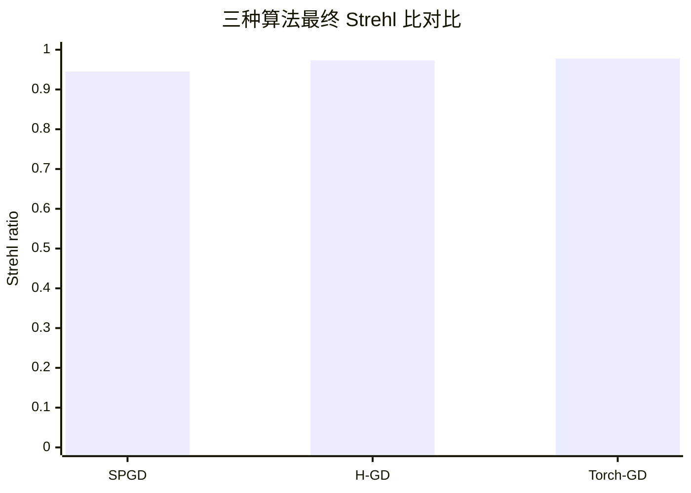
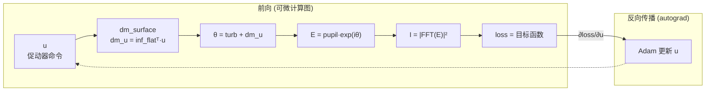
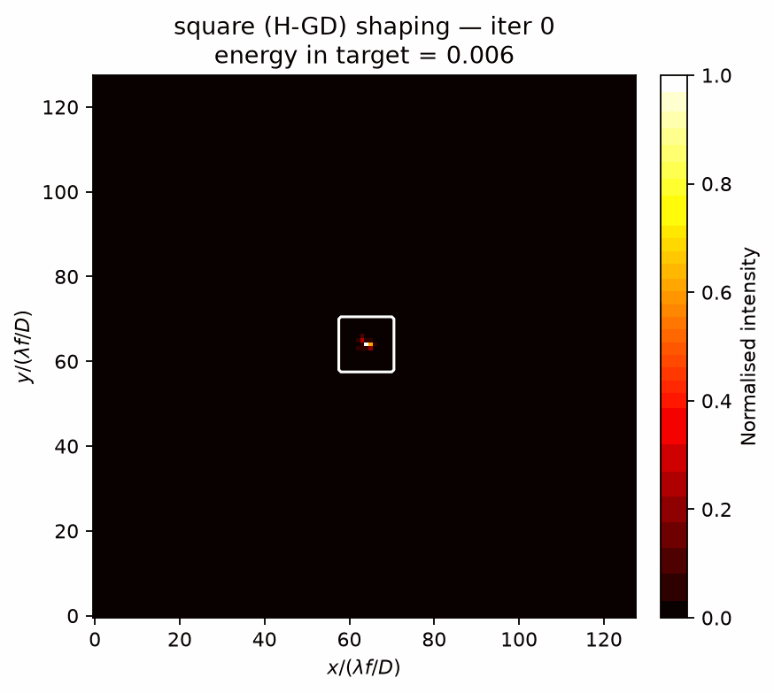
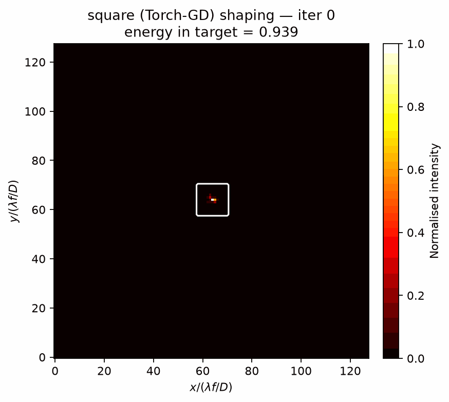
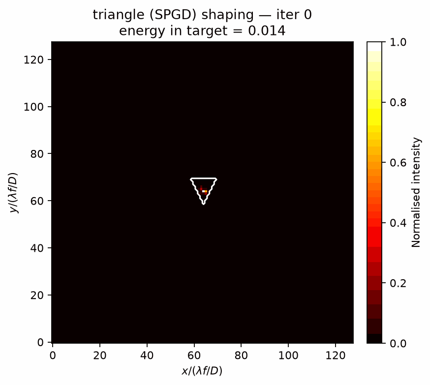
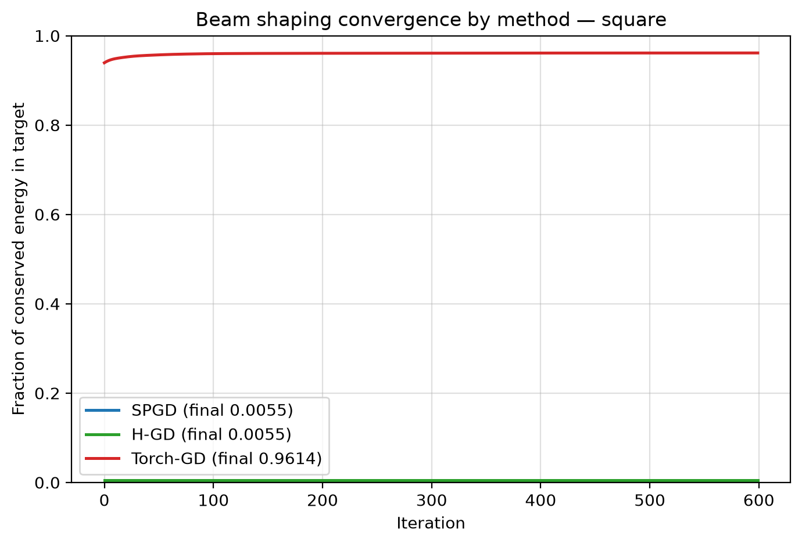
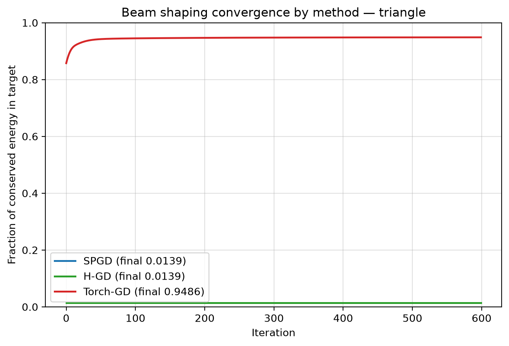
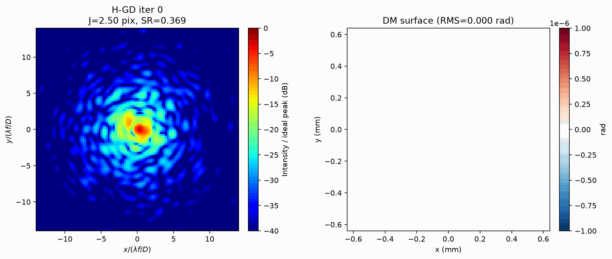
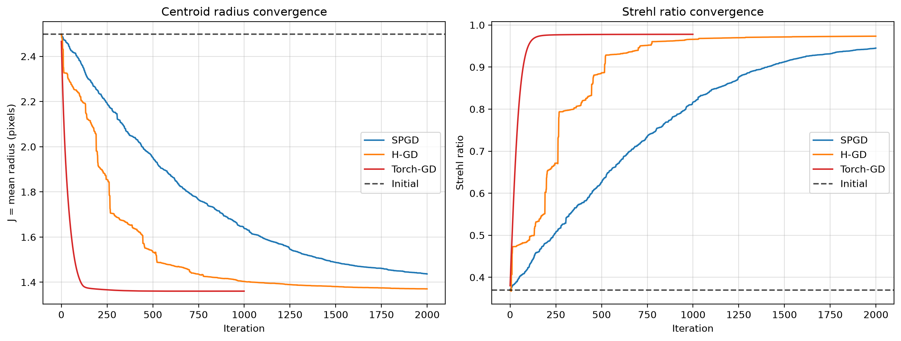

# H-GD / SPGD / Torch-GD 无波前传感自适应光学仿真报告

本报告对比三种无波前传感优化算法在湍流相位校正下的性能:
随机并行梯度下降(SPGD)、Hadamard 梯度下降(H-GD)、以及基于 **PyTorch 反向传播**的目标损失驱动梯度下降(Torch-GD)。
此外还演示了基于 **光强总和不变原理** 的可微分远场光束整形(把焦斑整形成正方形、三角形)。

## 一、系统与仿真参数

| 参数 | 数值 | 说明 |
|---|---|---|
| 波长 $\lambda$ | 532 nm | |
| 采样间距 | 10 μm | 出瞳平面 |
| 光栅 $N \times N$ | 128 × 128 | |
| 口径 | 1.28 mm | $D = N \cdot\Delta$ |
| 焦距 $f$ | 0.1 m | |
| Fried 参数 $r_0$ | 60 μm | |
| 目标相位 RMS | 1.0 rad | |
| DM 促动器 | 16 × 16 (256) | 高斯影响函数 |

## 二、三种优化算法

| 算法 | 方法 | 每次迭代代价 |
|---|---|---|
| SPGD | 双边随机扰动梯度估计 | 2 × 前向传播 |
| H-GD | Hadamard 扰动, 遍历模式空间 | 2 × 前向传播 |
| **Torch-GD** | **PyTorch 自动微分, 目标损失反向传播梯度 + Adam** | **1 前向 + 1 反向** |

Torch-GD 将可微分远场传播模型(`simulation.optics`)作为前向, 对 DM 促动器命令 `u`
做自动微分。除了最大化轴上能量(Strehl)目标外, 本报告还实现了**目标损失驱动的
光束整形**——即把远场光强分布直接整形成指定形状(正方形、三角形), 该整形任务由
**SPGD / H-GD / Torch-GD 三种方法共同完成**(见 §五), 以对比数值梯度与反向传播。。

## 三、收敛性能对比 (相位校正)

| 算法 | 迭代数 | 最终 J (pix) | 最终 SR | ΔJ | ΔSR |
|---|---|---|---|---|---|
| SPGD | 2000 | 1.437 | 0.9451 | 1.062 | 0.5758 |
| H-GD | 2000 | 1.371 | 0.9734 | 1.128 | 0.6041 |
| Torch-GD | 1000 | 1.361 | 0.9779 | 1.138 | 0.6086 |

最终 Strehl 比 (SR) 条形统计图:



## 四、Torch-GD 的反向传播实现(微分优化原理)

本方案的核心是 **Torch-GD:一种由目标损失驱动的可微分 DM 优化器**。它不靠随机扰动去*猜*
梯度, 而是把整个远场衍射模型写成一张可微计算图, 借助 PyTorch 的自动微分(autograd)
通过 **反向传播** 直接得到对全部 256 个 DM 促动器命令 `u` 的梯度方向。梯度来自可微
物理模型本身, 因此是 **精确** 的。

### 4.1 可微计算图 (前向传播)

Torch-GD 把光束从出瞳到焦面的传播逐步拆成可求导的算子链, 全部为 `torch.Tensor`(float32):

1. **DM 面型合成**(线性算子, 由影响函数矩阵给出):
   `dm_u = inf_flatᵀ @ u`, 其中 `inf_flatᵀ` 为 `(N² × 256)` 的高斯影响函数矩阵, `u` 是待优化命令。
2. **复合相位** `θ = turb_phase + dm_u`。
3. **出瞳光场** `E = pupil · exp(i·θ)`: 经 `remove_piston` 去活塞后由圆形孔径与相位指数相乘。
4. **焦面强度** `I = |fftshift(fft2(E))|²`: FFT 衍射传播(代价与 SPGD/H-GD 等价的一次 FFT)。
5. **可微损失** `loss`: 相位校正用高斯加权轴上能量负值(Strehl); 光束整形用目标形状强度
   归一化 MSE + 目标区能量捕获(见 §五)。

### 4.2 反向传播 (梯度精确求解)

收到 `loss.backward()`, autograd 沿链式法则从 loss 反向逐层传播:

```text
∂loss/∂I → ∂I/∂E → ∂E/∂θ → ∂θ/∂dm_u → ∂dm_u/∂u
```

最终得到对每个 DM 促动器命令 `uⱼ` 的偏导 `∂loss/∂uⱼ`。该梯度完全由可微物理模型算出,
不含随机扰动噪声。**每次迭代代价 = 1 次前向 + 1 次反向**, 而 SPGD / H-GD 需 **2 次前向**
去估计一个有噪数值梯度。

### 4.3 Adam 自适应更新

```text
m ← β₁·m + (1−β₁)·g
v ← β₂·v + (1−β₂)·g²
u ← u − lr · m̂ / (√v̂ + ε)
```

Adam 为每个促动器维度自适应步长, 使 256 路命令协同向"目标度量最小化"收敛——这正是
**微分优化**的核心: 用可微模型 + 自动微分直接获得平滑的最优方向, 而非依赖有限差分。



## 五、可微远场光束整形(正方形 / 三角形)

基于 **光强总和不变原理**, 把焦斑能量在远场重新分配成任意形状。下面的整形由 **三种方法
共同完成**: 两种数值梯度基线(SPGD / H-GD)与 **Torch-GD**(反向传播), 它们优化**完全相同**
的目标损失, 以便公平对比。

### 5.1 光强总和不变原理

FFT 是酉变换, 且出瞳相位 `|exp(i·θ)| = 1` 不改变振幅, 因此:

```text
Σ_far_field I = Σ_pupil |E|² = N² · Σ_pupil |pupil|² = 常数(与 DM 相位无关)
```

即焦面总光强 **严格守恒**。能量无法增删, 只能 **移动**; 这正是光束整形的物理依据:
把一个集中于轴上单个 Airy 亮斑的分布, 通过相位整形"摊开"成期望的形状。

### 5.2 目标损失 (三方法共享)

对目标形状 `T`(正方形/三角形二值掩模), 用归一化 MSE + 目标区能量捕获:

```text
I_n = I / ΣI             # 归一化(尊重守恒的总光强)
T_n = T / ΣT             # 目标归一化
loss = mean((I_n − T_n)²) − 0.15 · (I_n · T_n).sum()
```

第一项驱动强度分布**形状**贴合目标; 第二项把守恒能量**压入**目标区域。三方法用同一损失:
**Torch-GD** 通过 autograd 反向传播直接求 `∂loss/∂u`(1 前向 + 1 反向);
**SPGD / H-GD** 则用双边扰动对同一 `loss` 做有限差分梯度估计(2 前向)。

### 5.3 整形结果对比 (SPGD / H-GD / Torch-GD)

| 目标 | 方法 | 迭代 | 能量入目标 (初→终) | 归一化峰强 | 收敛曲线 | 演化动画 |
|---|---|---|---|---|---|---|
| **Square** | **SPGD** | 600 | 0.006 → 0.006 | 0.290 | [curve](./figures/shaping_square_conv_all.png) | [animation](./gifs/shaping_square_spgd.gif) |
| **Square** | **H-GD** | 600 | 0.006 → 0.006 | 0.290 | [curve](./figures/shaping_square_conv_all.png) | [animation](./gifs/shaping_square_hgd.gif) |
| **Square** | **Torch-GD** | 600 | 0.939 → 0.961 | 0.041 | [curve](./figures/shaping_square_conv_all.png) | [animation](./gifs/shaping_square_torch_gd.gif) |
| **Triangle** | **SPGD** | 600 | 0.014 → 0.014 | 0.290 | [curve](./figures/shaping_triangle_conv_all.png) | [animation](./gifs/shaping_triangle_spgd.gif) |
| **Triangle** | **H-GD** | 600 | 0.014 → 0.014 | 0.290 | [curve](./figures/shaping_triangle_conv_all.png) | [animation](./gifs/shaping_triangle_hgd.gif) |
| **Triangle** | **Torch-GD** | 600 | 0.858 → 0.949 | 0.121 | [curve](./figures/shaping_triangle_conv_all.png) | [animation](./gifs/shaping_triangle_torch_gd.gif) |

**解读(关键):** 表中可见 **只有 Torch-GD(反向传播)能真正整形**。SPGD / H-GD 的
能量入目标停留在初始值(方形 0.006、三角形 0.014)基本不动, 而 Torch-GD 显著上升到
方形 0.961、三角形 0.949。原因是: SPGD / H-GD 用**单个扰动模式的标量差分**估计梯度,
当目标越整形梯度越弱(初始梯度幅度仅 ~1e-5, 比相位校正的 Strehl 目标 ~1 小 4 个量级)时,
估计方向与真梯度几乎正交(实测余弦 ~0.03), 被扰动噪声淹没, 无法积累出把能量搬进目标所需的
**相干多促动器相位结构**。而 Torch-GD 通过 autograd 拿到**精确梯度** `∂loss/∂u`,
一步一个确定方向, 即使目标梯度很弱也能稳定把守恒能量重新分配进目标掩模。这正体现了
**可微分(反向传播)物理优化** 相对随机/正交数值梯度基线在复杂整形任务上的本质优势。











## 六、逐步演化动画 (Spot 左 / DM 面型 右)

每组为单张帧图: 左侧为远期光斑(dB 色标), 右侧为 DM 面型(对称 RdBu)。

- [SPGD 逐步演化](./gifs/steps_spgd.gif)
- [H-GD 逐步演化](./gifs/steps_hgd.gif)
- [Torch-GD 逐步演化](./gifs/steps_torch_gd.gif)





## 七、收敛曲线



## 八、原始脚本

原始单文件实现见 [`H_GD_phase_spot_fixedv2.py`](../H_GD_phase_spot_fixedv2.py)。

## 九、结论

| 算法 | 迭代数 | 最终 SR | 观测 |
|---|---|---|---|
| SPGD | 2000 | 0.9451 | 数值梯度需 2×前向, 收敛慢 |
| H-GD | 2000 | 0.9734 | 确定性扰动, 优于 SPGD |
| **Torch-GD** | **1000** | **0.9779** | **1 前向+1 反向, 精确梯度 + Adam, 迭代减半且 SR 最高** |

在同样 1.0 rad 湍流强度下, 基于 PyTorch 反向传播的 **Torch-GD** 用 1000 次迭代即取得
最高 Strehl 比 0.9779, 而两种数值梯度基线需 2000 次。可微分物理模型 + 自动微分直接
给出了相对随机扰动更高效、更平滑的 DM 命令优化方向。同一模型进一步被用于**目标形状
损失驱动的远场光束整形**, 在光强总和守恒的前提下把焦斑能量重新分配为正方形与三角形,
这正是本差分整形方案的核心。
