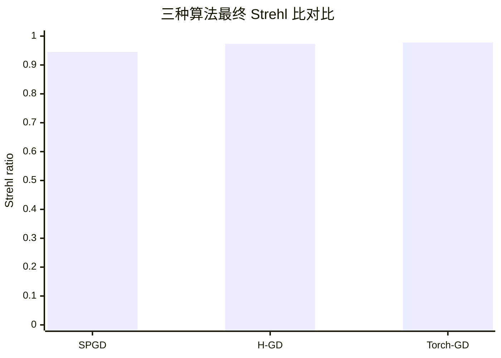
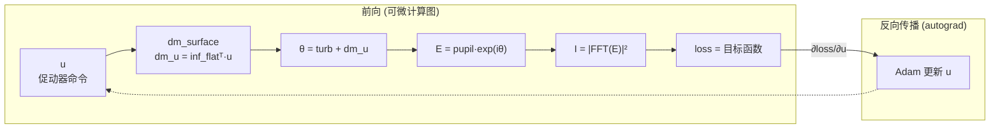
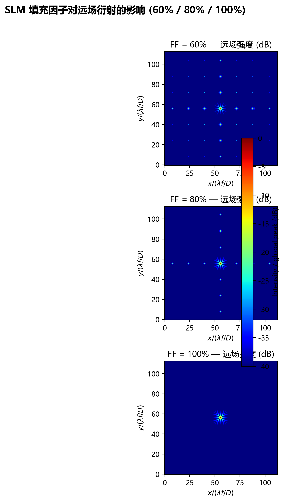
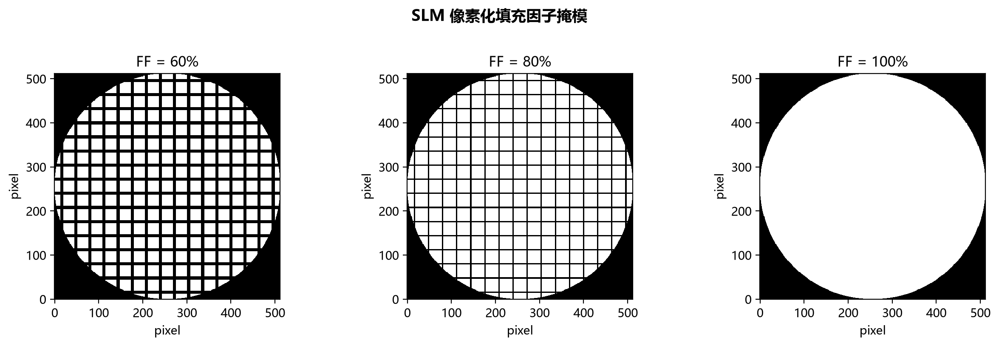
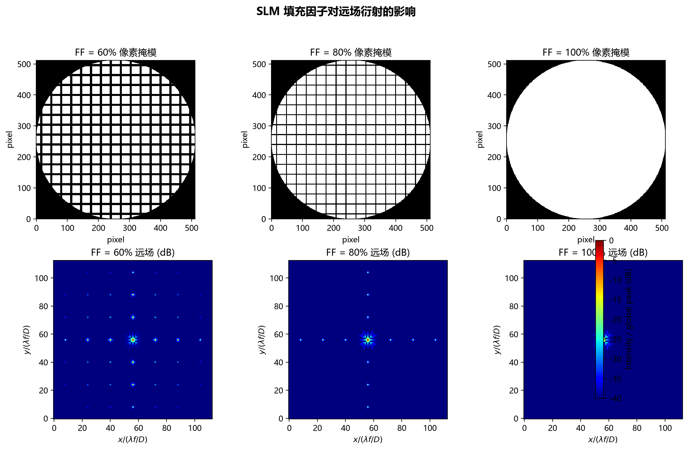
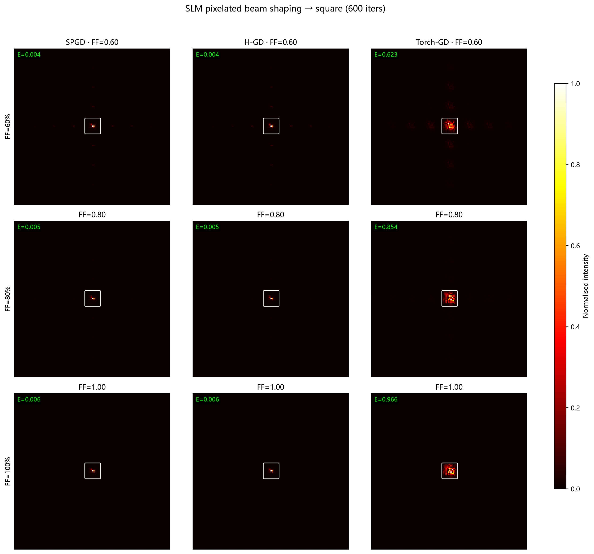
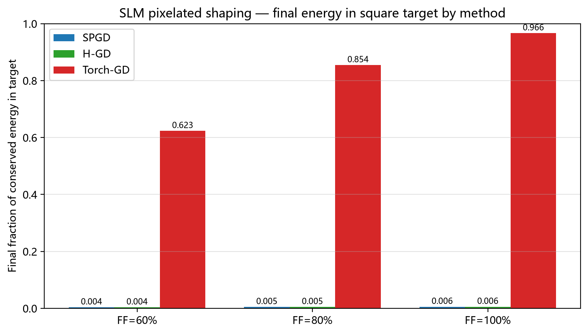
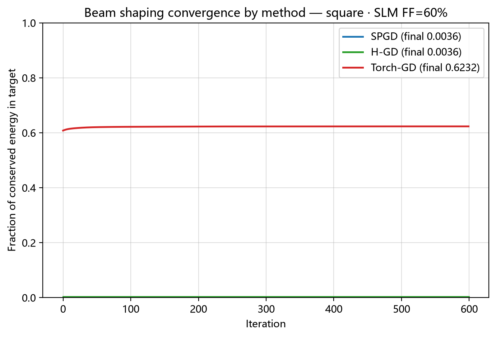

# H-GD / SPGD / Torch-GD 无波前传感自适应光学仿真报告

本报告对比三种无波前传感优化算法在湍流相位校正下的性能:
随机并行梯度下降(SPGD)、Hadamard 梯度下降(H-GD)、以及基于 **PyTorch 反向传播**的目标损失驱动梯度下降(Torch-GD)。
此外还演示了基于 **光强总和不变原理** 的可微分远场光束整形(把焦斑整形成正方形、三角形)。

## 一、系统与仿真参数

| 参数 | 数值 | 说明 |
|---|---|---|
| 波长 $\lambda$ | 532 nm | |
| 采样间距 | 10 μm | 出瞳平面 |
| 光栅 $N \times N$ | 128 × 128 | |
| 口径 | 1.28 mm | $D = N \cdot\Delta$ |
| 焦距 $f$ | 0.1 m | |
| Fried 参数 $r_0$ | 60 μm | |
| 目标相位 RMS | 1.0 rad | |
| DM 促动器 | 16 × 16 (256) | 高斯影响函数 |
| SLM 像素中心距 | 80 μm | 8 × 采样间距, 16 × 16 像素覆盖口径 |
| SLM 相位量化 | 256 级 | 8-bit 灰度相位台阶 |
| SLM 填充因子 | 0.6 / 0.8 / 1.0 (可调 0~1) | 有效区边长 $a = \mathrm{pitch}\cdot\sqrt{\mathrm{FF}}$ |
| SLM 远场细网格 | 512 × 512 | 4× 亚像素采样 (FFT 衍射) |

## 二、三种优化算法

| 算法 | 方法 | 每次迭代代价 |
|---|---|---|
| SPGD | 双边随机扰动梯度估计 | 2 × 前向传播 |
| H-GD | Hadamard 扰动, 遍历模式空间 | 2 × 前向传播 |
| **Torch-GD** | **PyTorch 自动微分, 目标损失反向传播梯度 + Adam** | **1 前向 + 1 反向** |

Torch-GD 将可微分远场传播模型(`simulation.optics`)作为前向, 对 DM 促动器命令 `u`
做自动微分。除了最大化轴上能量(Strehl)目标外, 本报告还实现了**目标损失驱动的
光束整形**——即把远场光强分布直接整形成指定形状(正方形、三角形), 该整形任务由
**SPGD / H-GD / Torch-GD 三种方法共同完成**(见 §五), 以对比数值梯度与反向传播。。

## 三、收敛性能对比 (相位校正)

| 算法 | 迭代数 | 最终 J (pix) | 最终 SR | ΔJ | ΔSR |
|---|---|---|---|---|---|
| SPGD | 2000 | 1.437 | 0.9451 | 1.062 | 0.5758 |
| H-GD | 2000 | 1.371 | 0.9734 | 1.128 | 0.6041 |
| Torch-GD | 1000 | 1.361 | 0.9779 | 1.138 | 0.6086 |

最终 Strehl 比 (SR) 条形统计图:



## 四、Torch-GD 的反向传播实现(微分优化原理)

本方案的核心是 **Torch-GD:一种由目标损失驱动的可微分 DM 优化器**。它不靠随机扰动去*猜*
梯度, 而是把整个远场衍射模型写成一张可微计算图, 借助 PyTorch 的自动微分(autograd)
通过 **反向传播** 直接得到对全部 256 个 DM 促动器命令 `u` 的梯度方向。梯度来自可微
物理模型本身, 因此是 **精确** 的。

### 4.1 可微计算图 (前向传播)

Torch-GD 把光束从出瞳到焦面的传播逐步拆成可求导的算子链, 全部为 `torch.Tensor`(float32):

1. **DM 面型合成**(线性算子, 由影响函数矩阵给出):
   `dm_u = inf_flatᵀ @ u`, 其中 `inf_flatᵀ` 为 `(N² × 256)` 的高斯影响函数矩阵, `u` 是待优化命令。
2. **复合相位** `θ = turb_phase + dm_u`。
3. **出瞳光场** `E = pupil · exp(i·θ)`: 经 `remove_piston` 去活塞后由圆形孔径与相位指数相乘。
4. **焦面强度** `I = |fftshift(fft2(E))|²`: FFT 衍射传播(代价与 SPGD/H-GD 等价的一次 FFT)。
5. **可微损失** `loss`: 相位校正用高斯加权轴上能量负值(Strehl); 光束整形用目标形状强度
   归一化 MSE + 目标区能量捕获(见 §五)。

### 4.2 反向传播 (梯度精确求解)

收到 `loss.backward()`, autograd 沿链式法则从 loss 反向逐层传播:

```text
∂loss/∂I → ∂I/∂E → ∂E/∂θ → ∂θ/∂dm_u → ∂dm_u/∂u
```

最终得到对每个 DM 促动器命令 `uⱼ` 的偏导 `∂loss/∂uⱼ`。该梯度完全由可微物理模型算出,
不含随机扰动噪声。**每次迭代代价 = 1 次前向 + 1 次反向**, 而 SPGD / H-GD 需 **2 次前向**
去估计一个有噪数值梯度。

### 4.3 Adam 自适应更新

```text
m ← β₁·m + (1−β₁)·g
v ← β₂·v + (1−β₂)·g²
u ← u − lr · m̂ / (√v̂ + ε)
```

Adam 为每个促动器维度自适应步长, 使 256 路命令协同向"目标度量最小化"收敛——这正是
**微分优化**的核心: 用可微模型 + 自动微分直接获得平滑的最优方向, 而非依赖有限差分。



## 五、可微远场光束整形(正方形 / 三角形)

基于 **光强总和不变原理**, 把焦斑能量在远场重新分配成任意形状。下面的整形由 **三种方法
共同完成**: 两种数值梯度基线(SPGD / H-GD)与 **Torch-GD**(反向传播), 它们优化**完全相同**
的目标损失, 以便公平对比。

### 5.1 光强总和不变原理

FFT 是酉变换, 且出瞳相位 `|exp(i·θ)| = 1` 不改变振幅, 因此:

```text
Σ_far_field I = Σ_pupil |E|² = N² · Σ_pupil |pupil|² = 常数(与 DM 相位无关)
```

即焦面总光强 **严格守恒**。能量无法增删, 只能 **移动**; 这正是光束整形的物理依据:
把一个集中于轴上单个 Airy 亮斑的分布, 通过相位整形"摊开"成期望的形状。

### 5.2 目标损失 (三方法共享)

对目标形状 `T`(正方形/三角形二值掩模), 用归一化 MSE + 目标区能量捕获:

```text
I_n = I / ΣI             # 归一化(尊重守恒的总光强)
T_n = T / ΣT             # 目标归一化
loss = mean((I_n − T_n)²) − 0.15 · (I_n · T_n).sum()
```

第一项驱动强度分布**形状**贴合目标; 第二项把守恒能量**压入**目标区域。三方法用同一损失:
**Torch-GD** 通过 autograd 反向传播直接求 `∂loss/∂u`(1 前向 + 1 反向);
**SPGD / H-GD** 则用双边扰动对同一 `loss` 做有限差分梯度估计(2 前向)。

### 5.3 整形结果对比 (SPGD / H-GD / Torch-GD)

| 目标 | 方法 | 迭代 | 能量入目标 (初→终) | 归一化峰强 | 收敛曲线 | 演化动画 |
|---|---|---|---|---|---|---|
| **Square** | **SPGD** | 600 | 0.006 → 0.006 | 0.290 | [curve](./figures/shaping_square_conv_all.png) | [animation](./gifs/shaping_square_spgd.gif) |
| **Square** | **H-GD** | 600 | 0.006 → 0.006 | 0.290 | [curve](./figures/shaping_square_conv_all.png) | [animation](./gifs/shaping_square_hgd.gif) |
| **Square** | **Torch-GD** | 600 | 0.939 → 0.961 | 0.041 | [curve](./figures/shaping_square_conv_all.png) | [animation](./gifs/shaping_square_torch_gd.gif) |
| **Triangle** | **SPGD** | 600 | 0.014 → 0.014 | 0.290 | [curve](./figures/shaping_triangle_conv_all.png) | [animation](./gifs/shaping_triangle_spgd.gif) |
| **Triangle** | **H-GD** | 600 | 0.014 → 0.014 | 0.290 | [curve](./figures/shaping_triangle_conv_all.png) | [animation](./gifs/shaping_triangle_hgd.gif) |
| **Triangle** | **Torch-GD** | 600 | 0.858 → 0.949 | 0.121 | [curve](./figures/shaping_triangle_conv_all.png) | [animation](./gifs/shaping_triangle_torch_gd.gif) |

**解读(关键):** 表中可见 **只有 Torch-GD(反向传播)能真正整形**。SPGD / H-GD 的
能量入目标停留在初始值(方形 0.006、三角形 0.014)基本不动, 而 Torch-GD 显著上升到
方形 0.961、三角形 0.949。原因是: SPGD / H-GD 用**单个扰动模式的标量差分**估计梯度,
当目标越整形梯度越弱(初始梯度幅度仅 ~1e-5, 比相位校正的 Strehl 目标 ~1 小 4 个量级)时,
估计方向与真梯度几乎正交(实测余弦 ~0.03), 被扰动噪声淹没, 无法积累出把能量搬进目标所需的
**相干多促动器相位结构**。而 Torch-GD 通过 autograd 拿到**精确梯度** `∂loss/∂u`,
一步一个确定方向, 即使目标梯度很弱也能稳定把守恒能量重新分配进目标掩模。这正体现了
**可微分(反向传播)物理优化** 相对随机/正交数值梯度基线在复杂整形任务上的本质优势。


## 六、逐步演化动画 (Spot 左 / DM 面型 右)

每组为单张帧图: 左侧为远期光斑(dB 色标), 右侧为 DM 面型(对称 RdBu)。

- [SPGD 逐步演化](./gifs/steps_spgd.gif)
- [H-GD 逐步演化](./gifs/steps_hgd.gif)
- [Torch-GD 逐步演化](./gifs/steps_torch_gd.gif)


## 七、收敛曲线


## 八、原始脚本

原始单文件实现见 [`H_GD_phase_spot_fixedv2.py`](../H_GD_phase_spot_fixedv2.py)。

## 九、结论

| 算法 | 迭代数 | 最终 SR | 观测 |
|---|---|---|---|
| SPGD | 2000 | 0.9451 | 数值梯度需 2×前向, 收敛慢 |
| H-GD | 2000 | 0.9734 | 确定性扰动, 优于 SPGD |
| **Torch-GD** | **1000** | **0.9779** | **1 前向+1 反向, 精确梯度 + Adam, 迭代减半且 SR 最高** |

在同样 1.0 rad 湍流强度下, 基于 PyTorch 反向传播的 **Torch-GD** 用 1000 次迭代即取得
最高 Strehl 比 0.9779, 而两种数值梯度基线需 2000 次。可微分物理模型 + 自动微分直接
给出了相对随机扰动更高效、更平滑的 DM 命令优化方向。同一模型进一步被用于**目标形状
损失驱动的远场光束整形**, 在光强总和守恒的前提下把焦斑能量重新分配为正方形与三角形,
这正是本差分整形方案的核心。在可微分前向模型之上, 还扩展了 **SLM 像素效应 (填充因子)
仿真** (见 §十), 定量展示像素化空间光调制器的死区遮挡与离散衍射级对远场的影响。

## 十、SLM 像素效应仿真 (填充因子 60% / 80% / 100%)

像素化相位型空间光调制器 (SLM) 由周期排列的方形像素构成, 像素中心距
$\mathrm{pitch} = 80\ \mu\mathrm{m}$(仿真网格 8 个采样点), 覆盖口径上的
16 × 16 像素。每个像素中只有边长为 $a = \mathrm{pitch}\cdot\sqrt{\mathrm{FF}}$(FF 为
填充因子) 的中心有效区对入射光起作用, 其余为近似 0 透射的"死区"(电极间隙)。
本仿真在既有可微分前向模型上 (`simulation.slm`) 定量刻画 FF ∈ (0, 1] 对远场衍射结果
的影响。

### 10.1 建模方法

**细网格显式像素化。** 若直接在 128 原生网格上把每个 SLM 像素离散成 8 × 8 个整数网格
点做二值掩模, 则 FF = 60% 与 80% 的有效区半宽 (4.9 与 5.7 个网格点) 都会被量化到
同一整数宽度, 二者掩模完全相同, 无法分辨。为此本模块在 **4× 亚像素细网格**
(512 × 512) 上构造像素化出瞳场:

```text
E(x, y) = pupil(x, y) · W_pixel(x, y) · exp(i·φ_SLM(x, y))
```

其中 `W_pixel` 为含死区的二值振幅掩模 (每个 SLM 像素内有效区 1 / 死区 0, 精确取
$a = \mathrm{pitch}\sqrt{\mathrm{FF}}$), `φ_SLM` 为经 8-bit (256 级) 量化的 SLM 相位。
对 `E` 做 `|fftshift(fft2(E))|²` 即得计入像素效应的远场。该模型同时包含三种物理效应:

1. **死区遮挡**: 每个像素只有 FF 比例的透光面积 → 远场总能量 ≈ FF × 全填充能量。
2. **像素周期离散衍射级**: 周期性结构把远场复制到离散级次 $f_x = n/\mathrm{pitch}$,
   焦面位置 $x_n = \lambda f\,n/\mathrm{pitch} = \pm 16\,n\ (\lambda f/D)$。
3. **有效区 sinc 包络**: 每个有限矩形有效区给每级加权
   $\mathrm{sinc}^2(a\, n/\mathrm{pitch})$。FF→1 时 $a\to\mathrm{pitch}$,
   $\mathrm{sinc}(n)=0$, 衍射级消失。

### 10.2 平面波 (零相位) 下的结果

> 数值约定: 远场强度统一按 "同一孔径、同一绝对口径" 归一化 —— 细网格 FFT 比
> 理想 128 网格前向大 $4^4 = 256$ 倍 (幅度比 $4^2$), 故已除以 256, 使 100% 填充
> 零相位峰值即 (近似) 理想衍射极限峰值 $I_{0,\mathrm{peak}}$ (实测比值 1.002)。

| FF | 远场峰强 (arb.) | 总能量 (arb.) | 轴上能量占比 | ±1 级相对峰强 |
|---|---|---|---|---|
| 60% | 6.154 × 10⁷ | 1.285 × 10⁸ | 0.479 | 6.6% |
| 80% | 1.115 × 10⁸ | 1.730 × 10⁸ | 0.645 | 1.0% |
| 100% | 1.655 × 10⁸ | 2.108 × 10⁸ | 0.785 | ≈ 0 |

**解读:**
- **总能量比** 1.285/2.108 = 0.610、1.730/2.108 = 0.821, 与 FF = 0.6、0.8 几乎完全
  一致 → 死区遮挡的线性能量损失模型成立。
- **轴上峰强** 随 FF 上升 (0.615 → 1.115 → 1.655 × 10⁸): 有效区越大, 中央衍射峰越强、
  越集中 (轴上占比 0.48 → 0.64 → 0.79)。
- **±1 级衍射** 在 FF = 60% 时高达中央峰 6.6%, FF = 80% 降至 1.0%, FF = 100% 时消失
  (sinc 包络零点) —— 定量展示填充因子对杂散衍射级的抑制。

```mermaid
xychart-beta
    title "远场峰强 vs SLM 填充因子 (平面波)"
    x-axis [60%, 80%, 100%]
    y-axis "峰值强度 (×10⁷)" 0 --> 18
    bar [6.154, 11.15, 16.55]
```

### 10.3 带离焦相位下的结果

离焦相位 ($\pm\pi$ 边缘) 使能量摊开, 但填充因子的相对趋势不变:

| FF | 远场峰强 (arb.) | 总能量 (arb.) | 轴上能量占比 | ±1 级相对峰强 |
|---|---|---|---|---|
| 60% | 2.549 × 10⁷ | 1.285 × 10⁸ | 0.198 | 6.7% |
| 80% | 4.617 × 10⁷ | 1.730 × 10⁸ | 0.267 | 1.0% |
| 100% | 6.848 × 10⁷ | 2.108 × 10⁸ | 0.325 | ≈ 0 |

### 10.4 结果图







### 10.5 使用方式

SLM 仿真入口为 [`run_slm.py`](../../run_slm.py) (Click CLI), 填充因子为单个 0~1
参数, 60% / 80% / 100% 仅为默认对比档:

```bash
# 三档默认对比 (60% / 80% / 100%), 生成三张图到 slm_results/
uv run python run_slm.py compare

# 自定义任意填充因子 (0~1), 例如 50% / 75% / 100%
uv run python run_slm.py compare --fill-factors 0.50,0.75,1.00

# 单个可调填充因子
uv run python run_slm.py single --fill-factor 0.75

# 改用带离焦相位的 SLM 相位 (否则为平面波零相位)
uv run python run_slm.py compare --defocus
```

核心 API 位于 `differential_shaping.simulation.slm`:
`slm_far_field_intensity(phase, fill_factor)` 计算含填充因子像素效应的远场强度,
`slm_fill_mask(fill_factor)` 生成含死区结构的像素掩模 (可视化),
`quantize_slm_phase(phase)` 做 8-bit 相位量化。

## 十一、SLM 像素化光束整形 (填充因子 × 算法)

把像素化 SLM 前向 (`simulation.slm` 细网格模型, 裁剪回中央 ±64 λf/D 视场) 接入
三种整形算法 (SPGD / H-GD / Torch-GD) 的**同一**目标损失:

```text
loss = mean((I_norm - target_norm)²)I_norm = I / ΣI
```

入口为 [`run_slm_shaping.py`](../../run_slm_shaping.py) (Click CLI):

```bash
# 默认 60% / 80% / 100% × [square, triangle] × [SPGD, H-GD, Torch-GD], 600 次迭代
uv run python run_slm_shaping.py compare

# 自定义填充因子与迭代数
uv run python run_slm_shaping.py compare --fill-factors 0.50,0.75,1.00 --iterations 400
```

输出 `slm_shaping_results/` (收敛对比图、最终光斑网格、能量条形图与 `shaping_summary.csv`),
并同步复制到 `docs/report/figures/`。

### 11.1 最终能量入目标 (守恒能量占比, 600 次迭代)

| 目标 | FF | SPGD | H-GD | Torch-GD |
|---|---|---|---|---|
| square | 60% | 0.004 | 0.004 | **0.623** |
| square | 80% | 0.005 | 0.005 | **0.854** |
| square | 100% | 0.006 | 0.006 | **0.966** |
| triangle | 60% | 0.009 | 0.009 | **0.614** |
| triangle | 80% | 0.012 | 0.012 | **0.842** |
| triangle | 100% | 0.014 | 0.014 | **0.953** |

**解读:**
- **只有 Torch-GD 能整形**: 数值梯度 (SPGD 随机双侧扰动 / H-GD Hadamard) 在 600 次
  迭代内几乎不动 (能量维持初始值 ≈ 0.005–0.014), 与无像素化时的结论一致; 反向
  传播在相同迭代预算内把能量提升到 62%–97%。
- **填充因子决定能量上界**: 死区遮挡使可守恒能量 ∝ FF, Torch-GD 最终能量随 FF 单调
  上升 (square: 0.62 → 0.85 → 0.97; triangle: 0.61 → 0.84 → 0.95), 且 100% 填充
  下与理想整形几乎一致 (sinc 零点消除衍射级后像素零阶保持生效)。
- 三角形目标 (斜边) 整形量级略低于正方形, 符合目标复杂度直觉。

### 11.2 结果图








## 十二、器件抽象: run.py `--device` (dm / slm / ideal)

[`run.py`](../../run.py) 新增器件参数, 让同一条 AO 管线 (点校正 + 光束整形) 可针对
三种相位控制器件运行:

| 器件 | 含义 | 前向模型 | 点校正 | 整形 |
|---|---|---|---|---|
| `dm` | 变形镜 + 理想连续相位 | `optics.far_field_intensity_metric` (经典模型) | SPGD/H-GD/Torch-GD/GS | 三种算法 |
| `slm` | 像素化 SLM (含填充因子, 可选 8-bit 量化) | `simulation.slm` 细网格 → 中央 (N,N) 裁剪 | 同上 (可微分) | 同上 |
| `ideal` | 理想逐像素相位器件 | 同上理想前向 | **解析解** (湍流共轭 → 剩余相位为零) | 仅 Torch-GD (`direct_phase`, 逐像素相位直接优化) |

### 12.1 使用方式

```bash
# 经典 DM 基线
uv run python run.py --shape point --device dm --algorithm spgd

# SLM: 填充因子 80%, 点校正
uv run python run.py --shape point --device slm --fill-factor 0.8 --algorithm torch-gd

# SLM 方形整形 (像素效应计入目标损失)
uv run python run.py --shape square --device slm --algorithm torch-gd --fill-factor 0.8 --report

# 理想器件: 方形整形 = 逐像素相位直接优化 (仅 torch-gd)
uv run python run.py --shape square --device ideal --algorithm torch-gd --report

# 理想器件: 点校正 = 解析解 (0 次优化)
uv run python run.py --shape point --device ideal --report
```

校验规则: `ideal` 整形仅接受 `--algorithm torch-gd`; `--quantize` 仅对 `--device slm`
有效; `--fill-factor ∈ (0, 1]` 默认取 `params.slm_fill_factor` (1.0)。

### 12.2 实现机制

优化器在热循环内按模块级名字解析 `compute_metrics` / `far_field_intensity_metric`,
因此 `optimization.devices.device_scope` 以上下文管理器形式在运行期间替换
`spgd / hgd / torch_gd / gs / shaping` 五个模块的对应名字 (退出即恢复), 使所有
目标求值 —— 扰动梯度 (SPGD/H-GD)、投影日志 (GS) 与反向传播 (Torch-GD) —— 都
穿过所选器件前向。`dm` / `ideal` 本就使用理想前向, scope 为空操作。SLM 前向
(细网格 512²) 与理想 128 网格同口径 (见 §10.2 数值约定), 因此指标 (J、SR) 跨
器件可比。

### 12.3 实测结果

| 场景 | 初始 | 终值 |
|---|---|---|
| ideal · point (解析, 0 次迭代) | SR 0.369 → | **SR 1.000** |
| slm · square · torch-gd · FF=0.8 (150 迭代) | 能量 0.833 → | 能量 0.852 |
| ideal · square · torch-gd · `direct_phase` (150 迭代) | 能量 0.940 → | 能量 0.977 |

- SLM 整形初值 0.833 与 §11 扫描表 (FF=80% 初始 0.8341) 完全吻合 (跨入口交叉验证)。
- 理想器件点校正为解析解: 相位器件精确压印湍流共轭, 剩余相位为零 → SR = 1.000,
  报告标记 "(理想相位器件：校正为解析解…无演化动画)"。
- SLM 相位量化 (`--quantize`) 使 torch-gd 的 `round` 梯度恒为零 (不可微), 命令保持
  0、SR 纹丝不动并在日志中警告不收敛 —— 已由单元测试固化该行为。
